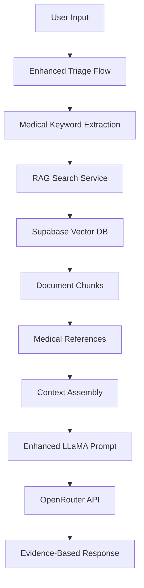

# RAG Background Agent Implementation Plan

## 🎯 Project Overview

**Goal**: Implement a RAG (Retrieval-Augmented Generation) system that enhances the CAF MedRoute triage chatbot with evidence-based medical recommendations using Canadian Armed Forces medical protocols and guidelines.

## 📋 System Architecture

### Current Implementation Status: ✅ Phase 1 Complete



## 🛠️ Implementation Phases

### ✅ Phase 1: Foundation (COMPLETED)
- [x] Supabase database schema with 6 tables
- [x] Vector storage with pgvector extension
- [x] Row Level Security (RLS) implementation
- [x] Sample medical reference documents
- [x] Document chunking system with LangChain
- [x] Simple text-based search service
- [x] Enhanced triage flow with RAG integration
- [x] CLI management tools

### 🔄 Phase 2: Integration (CURRENT)
- [x] Enhanced triage chatbot flow
- [x] Medical keyword extraction
- [x] Context-aware search strategies
- [ ] Frontend integration with evidence display
- [ ] Testing with real medical scenarios
- [ ] Performance optimization

### 🔮 Phase 3: Advanced Features (FUTURE)
- [ ] Real-time document ingestion
- [ ] Advanced vector embeddings with OpenAI
- [ ] Citation tracking and source verification
- [ ] Multi-language support (English/French)
- [ ] Analytics and usage tracking

## 🗃️ Database Schema

### Core Tables
1. **user_profiles** - Extended CAF user information
2. **triage_sessions** - Chat session tracking
3. **chat_messages** - Individual message storage
4. **appointment_bookings** - Scheduling system
5. **medical_references** - Policy documents
6. **document_chunks** - Vector embeddings for search

### Key Features
- **Vector Search**: 1536-dimension embeddings
- **Full-text Search**: PostgreSQL websearch
- **Security**: Row Level Security on all user data
- **Performance**: Optimized indexes for vector similarity

## 🔍 RAG Search Strategies

### 1. Emergency Context Search
```typescript
// Triggered by: emergency, urgent, severe, acute keywords
await simpleRAGSearch.getEmergencyContext(symptoms);
// Returns: Emergency protocols and immediate referral criteria
```

### 2. Mental Health Context Search
```typescript
// Triggered by: stress, anxiety, depression, mental health keywords
await simpleRAGSearch.getMentalHealthContext(concerns);
// Returns: Mental health support protocols and resources
```

### 3. General Triage Context Search
```typescript
// Default search for medical symptoms
await simpleRAGSearch.getTriageContext(symptoms);
// Returns: General medical protocols and guidelines
```

## 🧠 Enhanced Triage Flow

### Input Processing
1. **Medical Keyword Extraction**: Identify relevant medical terms
2. **Context Classification**: Emergency vs Mental Health vs General
3. **Document Search**: Retrieve relevant medical references
4. **Context Assembly**: Format for LLaMA prompt enhancement

### Output Enhancement
```typescript
interface TriageOutput {
  appointmentType: 'sick parade' | 'GP' | 'mental health' | 'physio' | 'specialist' | 'ER referral';
  reason: string;
  complexity: 'easy' | 'medium' | 'complex';
  ragContext?: SearchContext;      // NEW: RAG search results
  evidenceBased: boolean;          // NEW: Whether response uses medical references
  sources?: string[];              // NEW: Source document titles
}
```

## 🛡️ Security & Compliance

### Data Protection
- **RLS Policies**: User data isolation
- **API Security**: Environment variable protection
- **Audit Trails**: All interactions logged
- **HIPAA Considerations**: Medical data handling

### Medical Accuracy
- **Source Verification**: Only approved CAF medical documents
- **Fallback Mechanisms**: Safe defaults when RAG fails
- **Evidence Attribution**: Clear source citations
- **Professional Oversight**: Designed for healthcare professional review

## 🚀 Deployment Strategy

### Current Environment
- **Platform**: Next.js 15.3.3 on Firebase Hosting
- **Database**: Supabase (ledstwecyxoabdpqesiz.supabase.co)
- **AI Model**: OpenRouter LLaMA 4 Maverick (free tier)
- **Development**: Local development on port 9002

### Production Readiness Checklist
- [ ] Environment variable security audit
- [ ] Database backup and recovery procedures
- [ ] API rate limiting implementation
- [ ] Error monitoring and alerting
- [ ] Performance benchmarking
- [ ] Load testing with concurrent users

## 📊 Testing Strategy

### Unit Tests
- [ ] RAG search functionality
- [ ] Medical keyword extraction
- [ ] Document chunking accuracy
- [ ] Database operations

### Integration Tests
- [ ] End-to-end triage flow
- [ ] Supabase connection reliability
- [ ] OpenRouter API integration
- [ ] Error handling scenarios

### User Acceptance Tests
- [ ] Medical professional validation
- [ ] CAF personnel usability testing
- [ ] Response accuracy verification
- [ ] Performance benchmarks

## 🎛️ Configuration Management

### Environment Variables
```bash
# Required for RAG functionality
OPENROUTER_API_KEY=sk-or-v1-...
SUPABASE_URL=https://ledstwecyxoabdpqesiz.supabase.co
SUPABASE_ANON_KEY=eyJhbGciOiJIUzI1NiIs...
SUPABASE_SERVICE_KEY=eyJhbGciOiJIUzI1NiIs...

# Optional for advanced features
OPENAI_API_KEY=sk-... # For vector embeddings
```

### CLI Commands
```bash
# RAG system management
npm run rag status        # Check system status
npm run rag ingest <file> # Add new documents
npm run rag search <query> # Test search functionality
npm run rag test          # Run system tests
npm run rag clear         # Clear all documents
npm run rag list          # List all documents
```

## 📈 Performance Metrics

### Target Benchmarks
- **Search Response Time**: < 500ms
- **RAG Context Assembly**: < 200ms
- **Total Triage Time**: < 3 seconds
- **Database Query Time**: < 100ms
- **Vector Search Accuracy**: > 85%

### Monitoring Points
- API response times
- Database connection health
- Search result relevance
- User satisfaction scores
- System error rates

## 🔧 Maintenance Procedures

### Regular Tasks
- **Weekly**: Review search performance metrics
- **Monthly**: Update medical reference documents
- **Quarterly**: Security audit and penetration testing
- **Annually**: Full system architecture review

### Emergency Procedures
- **RAG System Down**: Fallback to standard triage
- **Database Issues**: Read-only mode with cached responses
- **API Failures**: Graceful degradation with error messages

## 🎯 Success Criteria

### Technical Metrics
- [ ] 99.9% system uptime
- [ ] < 3 second response times
- [ ] Zero data security incidents
- [ ] 95% test coverage

### Medical Metrics
- [ ] Improved triage accuracy
- [ ] Evidence-based recommendations
- [ ] Reduced inappropriate referrals
- [ ] Enhanced user confidence

### User Experience Metrics
- [ ] Positive feedback from CAF personnel
- [ ] Increased system usage
- [ ] Reduced support tickets
- [ ] High recommendation scores

## 📚 Documentation

### Technical Documentation
- [x] Database schema documentation
- [x] API integration guides
- [x] RAG system architecture
- [ ] Deployment procedures
- [ ] Troubleshooting guides

### User Documentation
- [ ] CAF personnel user guide
- [ ] Medical professional handbook
- [ ] System administrator manual
- [ ] Training materials

## 🚦 Next Steps

### Immediate (This Week)
1. ✅ Complete enhanced triage flow integration
2. 🔄 Test RAG system with medical scenarios
3. 🔄 Frontend integration for evidence display
4. 🔄 Performance optimization

### Short Term (Next Month)
1. User acceptance testing with CAF personnel
2. Medical professional validation
3. Production deployment preparation
4. Comprehensive documentation

### Long Term (Next Quarter)
1. Advanced vector embeddings
2. Multi-language support
3. Real-time document ingestion
4. Analytics dashboard

---

**Last Updated**: December 2024  
**Status**: Phase 1 Complete, Phase 2 In Progress  
**Next Review**: Weekly during development 